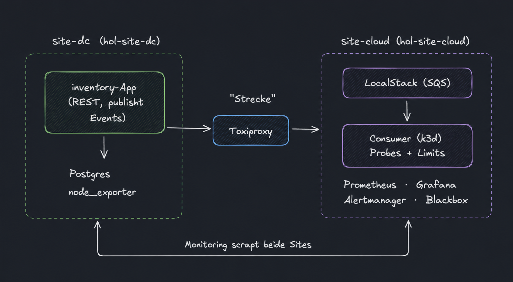
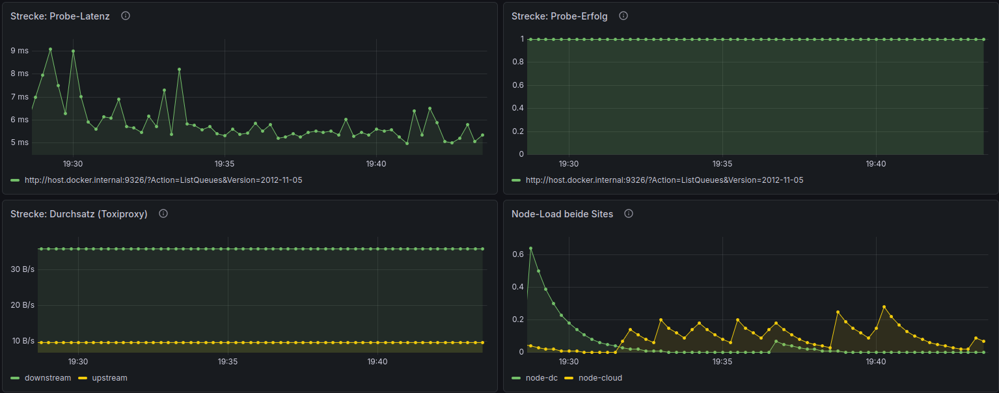
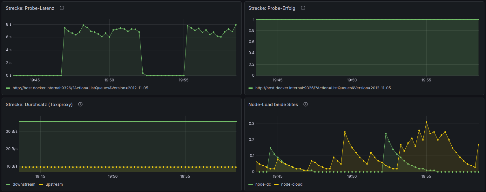
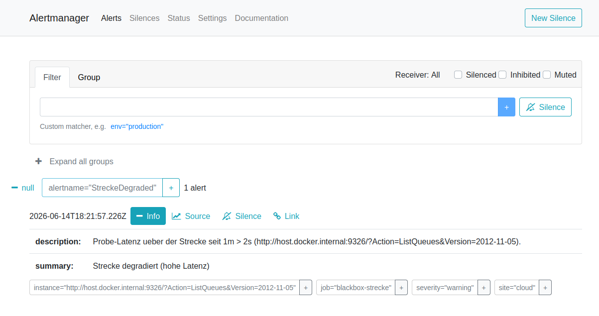

# hybrid-ops-lab

Showcase-Projekt für eine DevOps-Rolle (Hybrid Cloud / Data Center).

Demonstriert einen Event-Driven-Flow über zwei simulierte Standorte:
ein Data-Center-Stack (`site-dc`) und einen Cloud-Stack (`site-cloud`),
verbunden über eine gedrosselte Netzwerkstrecke (Toxiproxy).

## Architektur-Überblick



Das Diagramm zeigt die Zielarchitektur. Der aktuelle Implementierungsstand
steht im Abschnitt [Status](#status).

## Monitoring & Incident-Nachweis

Prometheus scrapt beide Standorte (node-Metriken, die inventory-App und Toxiproxy)
und probt die Strecke zusätzlich per Blackbox-Exporter. Ein provisioniertes
Grafana-Dashboard macht die Signale sichtbar.



Normalbetrieb: Die Probe-Latenz über die Strecke liegt im einstelligen
Millisekundenbereich, die Probe ist erfolgreich (Wert 1), der Durchsatz durch den
Toxiproxy-Proxy ist stabil, und beide Sites liefern ihre node-Metriken.



Incident: Eine über Toxiproxy injizierte Latenz von ~7 s lässt die Probe-Latenz
sprunghaft ansteigen — die beiden Plateaus sind zwei Drossel-Zyklen. Die Probe
bleibt dabei erfolgreich (Wert 1): die Strecke ist langsam, nicht tot. Nach dem
Aufheben der Störung fällt die Latenz sofort zurück. Reproduzierbar über die
Chaos-Skripte in `ops/chaos/`; Ablauf und Diagnose im
[Runbook](docs/runbook-link-degradation.md).

Auf dasselbe Signal feuert eine Alert-Regel: `StreckeDegraded`
(`probe_duration_seconds > 2` für 1 Minute) geht nach anhaltender Drosselung in
den Zustand *firing* und wird an den Alertmanager geroutet.



Der Alertmanager nutzt im Lab einen Null-Receiver (kein echter Versand, keine
Secrets im Repo); eine zweite Regel `StreckeDown` (`probe_success == 0`) deckt den
Totalausfall ab.

## Schnellstart

Voraussetzungen: zwei Ubuntu-24-VMs (hol-site-dc, hol-site-cloud) im selben Netz,
Docker, k3d und OpenTofu 1.12.1 auf beiden VMs installiert.
Detaillierte VM-Einrichtung: siehe `ops/bootstrap/`.

```bash
make up              # beide Sites hochfahren
make check           # Konnektivitäts-Check
make demo-incident   # Toxiproxy-Störung einschalten
make demo-restore    # Störung aufheben
make down            # alles stoppen
```

## Struktur

```
hybrid-ops-lab/
├── site-dc/          # Docker-Compose: inventory-App, Postgres, node_exporter
├── site-cloud/       # k3d-Config, Consumer-Manifest
├── infra/
│   ├── modules/
│   │   ├── event-queue/   # OpenTofu-Modul: SQS-Queue
│   │   └── workload/      # OpenTofu-Modul: K8s-Ressourcen
│   └── environments/
│       ├── dc/            # gegen LocalStack
│       └── cloud/         # gegen LocalStack / echtes AWS
├── monitoring/       # Prometheus, Grafana, Alertmanager, Blackbox
├── ops/              # healthcheck.ps1, chaos-Skripte, bootstrap/
└── docs/
    ├── decisions/    # ADRs
    ├── runbook-link-degradation.md
    ├── architecture.md
    ├── aws-mapping.md
    └── provider-management.md
```

## Sicherheit

Keine produktiven Secrets im Repository. Siehe [SECURITY.md](SECURITY.md).

## Entscheidungen

- [ADR-001](docs/decisions/001-warum-lokal-statt-aws.md) – Warum lokal statt echtes AWS
- [ADR-002](docs/decisions/002-zwei-vms-statt-einer.md) – Warum zwei VMs statt einer
- [ADR-003](docs/decisions/003-toxiproxy-als-strecke.md) – Toxiproxy als Standortverbindung
- [ADR-004](docs/decisions/004-proxmox-provisionierung.md) – Proxmox-Provisionierung via OpenTofu
- [ADR-005](docs/decisions/005-elasticmq-statt-localstack.md) – ElasticMQ statt LocalStack als SQS-Endpoint
