# Handoff — Phase 2B / Gate A (abgeschlossen)

Nachvollziehbarer Verlauf des site-dc-Upgrades auf den Phase-2B-Stand
(Transactional Outbox) bis zum formal abgeschlossenen **Gate A**. Dieses Dokument
ist die maßgebliche Quelle für den *bewiesenen* Zustand. Historische Fehler und
Zwischenzustände bleiben bewusst erhalten — sie werden nicht entfernt und nicht
als „nie passiert" dargestellt.

> This public handoff contains no credentials, private keys, customer data or
> non-public personal data. Environment-specific paths and infrastructure
> identifiers are represented in generalized form.
>
> All infrastructure names, roles, records and runtime evidence shown here belong
> to an isolated synthetic lab environment and do not represent an employer,
> customer or production system.

## Source of Truth

| Bereich | Aktueller Wahrheitsstand |
|---|---|
| Gate-A implementation baseline | `73e2ef96635ae9332a4dc43bdea61bffa0dc0a48` (Merge PR #8) |
| Sauberes Source-Repo (Lab) | `<source-root>/hybrid-ops-lab` |
| Freigegebenes, commitgebundenes Release | `<release-root>/<approved-release>` |
| Vorheriges Rollout-Release | `<release-root>/<rollout-release>` |
| Maßgebliche State-Datei | `<state-root>/.hol-upgrade-<rollout-id>.state` |
| Rollout-State | `complete` |
| DB-Migrationen | `0001`, `0002`, `0003` angewandt |
| `stock_movements` | `2` (synthetische Lab-Testdaten) |
| `event_outbox` | `2`, alle `pending` (synthetische Lab-Testdaten) |
| `VERIFY-1` | genau ein Movement + genau ein passendes Outbox-Event (synthetischer Lab-Test) |
| Events (`EVENTS_ENABLED`) | `false` (deaktiviert) |
| Publisher / Phase 3 | noch nicht begonnen |
| Gate A | abgeschlossen (technisch und formal) |

## Verlauf (chronologisch, mit erhaltener Fehlerhistorie)

### 1. Ursprünglicher Rollout-Abbruch
Der erste Upgrade-Versuch brach in Phase `prepare-done` ab: Die Alt-Rolle
`inventory` ist zugleich Cluster-Superuser und besitzt geteilte, cluster-weite
Objekte (`postgres`, `template0/1`, `pg_default`/`pg_global`). Ein
`REASSIGN OWNED BY inventory` wirkt cluster-weit und scheitert an
`DependentObjectsStillExist`. Die State-Datei `.hol-upgrade-f877b5c.state` steht
weiterhin auf `prepare-done` und bleibt als historischer Nachweis erhalten.

Behoben durch **gezielte, objekt-spezifische Ownership-Übertragung**
(`ops.db.reassign`, Allowlist, eine Transaktion, Verifikation vor Commit) statt
`REASSIGN OWNED` — gemerged als Release-Stand `3e9140f`.

### 2. Technisch erfolgreicher Live-Zustand bei `runtime-up`
Der Rollout aus Release `3e9140f` migrierte die DB erfolgreich (0001–0003),
übertrug die Ownership gezielt, backfillte `event_outbox` 1:1 und startete die
neue Runtime als Least-Privilege-Rolle `inventory_app`. Der Live-Zustand war
damit **technisch korrekt** und erreichte Phase `runtime-up`.

### 3. Ursache des formalen Fehlers
Der abschließende `verify` (mit echtem `POST /movements`) schlug **nicht** an der
Laufzeit, sondern ausschließlich im **Verification-Harness** fehl: dem
Verifikations-Container fehlte das `NEWID` für den Schreibtest. Der formale State
blieb deshalb auf `runtime-up` stehen, obwohl die Migration bereits erfolgreich war.

### 4. PR #7 — NEWID-Fix
`fix(ops): pass NEWID to Phase 2B verification container` (`844f4f5`) übergibt das
`NEWID` korrekt an den Verifikations-Container. Reine Harness-Korrektur, kein
Eingriff in Migration oder Laufzeit.

### 5. PR #8 — Safe Resume, atomarer State und Lock
`feat(ops): add safe Phase 2B resume path` führt einen read-only `resume`-Pfad ein,
der einen bereits migrierten `runtime-up`/`verified`-Zustand erneut verifiziert und
den State **atomar** weiterschaltet, abgesichert durch einen exklusiven `flock`.
Gemerged als `73e2ef96635ae9332a4dc43bdea61bffa0dc0a48` (Merge PR #8).

### 6. Vorbereitung des neuen Releases `73e2ef9`
Aus dem freigegebenen Merge-Commit wurde das freigegebene, commitgebundene Release
`<release-root>/<approved-release>` erstellt. Maßgeblich für den State bleibt
weiterhin die State-Datei des ursprünglichen Rollouts
(`<state-root>/.hol-upgrade-<rollout-id>.state`) — der Resume aus dem neueren
Release zeigt per `STATE_FILE`-Override genau auf diese Datei.

### 7. Einmalige erfolgreiche Resume-Ausführung
Am **20.06.2026 während der kontrollierten Gate-A-Verifikation** wurde der
Safe-Resume **genau einmal** ausgeführt, Exit-Code `0`. Read-only nachgewiesen:

- DB-/Objekt-Owner korrekt; Migrationen `0001`, `0002`, `0003` angewandt
- Rollen korrekt, ohne Superuser-/`CREATEROLE`/`CREATEDB`/`BYPASSRLS`/Replikation
- `stock_movements = 2`, `event_outbox = 2`, alle Outbox-Einträge `pending`
- kein Movement ohne passendes Outbox-Event
- genau ein bestehendes `VERIFY-1` + genau ein dazugehöriges Outbox-Event
- `EVENTS_ENABLED=false`; `/healthz=200`; `/readyz=200`; Least-Privilege bestanden

Dabei gab es **keinen** POST, **keine** neue Migration, **keine** DB-Mutation,
**keinen** neuen Container, **keinen** Build und **kein** Start/Stop/Restart/Recreate.
Container-ID, Image-ID, `StartedAt` und `RestartCount` der DB- und Inventory-Container
blieben unverändert; das Volume `hol-site-dc_pgdata` blieb unverändert; die
Release-`.env` blieb in Inhalt, Hash, mtime, Owner und Modus unverändert.

Der State-Write erfolgte atomar; keine `.hol-state.*`-Tempdatei blieb zurück. Durch
den atomaren Austausch wechselte die State-Datei von Modus `0664` auf `0600`.
`.hol-upgrade.lock` existiert nun als leere Lock-Datei; kein Prozess hält den Lock.
Das vorherige Rollout-Release und die pre-existing legacy working copy
(`<legacy-working-copy>`) blieben unangetastet.

### 8. Finaler State `complete`
State-Übergang `runtime-up → verified → complete`. Finaler State: `complete`.

### 9. Gate A abgeschlossen
Phase-2B-Migration, kontrollierter Rollout und Safe Resume sind technisch und
formal abgeschlossen.

### 10. Phase 3 noch nicht begonnen
Der Publisher (liest `pending`-Zeilen aus `event_outbox` und versendet sie an die
Queue) ist **nicht** gestartet. Events bleiben deaktiviert, die Outbox-Einträge
bleiben `pending`, und es gibt **keinen** direkten Publish im HTTP-Request-Pfad.

## Bewiesener aktueller Zustand (Diagramm)

Das folgende Diagramm zeigt ausschließlich den nachgewiesenen Live-Zustand. Der
Publisher-/Queue-Pfad ist als **nächste Phase** markiert, nicht als laufender
Bestandteil.

```mermaid
flowchart LR
    client([HTTP-Client]) -->|POST /movements 201| api

    subgraph live["site-dc — live & bewiesen (Gate A complete)"]
        direction TB
        api["inventory API (FastAPI)<br/>Rolle: inventory_app (least privilege)<br/>/healthz=200 /readyz=200<br/>EVENTS_ENABLED=false"]
        subgraph pg["PostgreSQL — eine atomare Transaktion"]
            direction TB
            mv["stock_movements (2)"]
            ob["event_outbox (2, alle pending)"]
            mv <-->|"FK 1:1 (movement_id, event_id)"| ob
        end
        api -->|"INSERT movement + outbox-event<br/>(gemeinsam committed)"| pg
    end

    subgraph next["nächste Phase (Phase 3) — noch nicht begonnen"]
        direction TB
        pub["Publisher (SELECT + begrenztes UPDATE)<br/>liest pending → publiziert → markiert published"]
        queue[["Queue: ElasticMQ / SQS"]]
        consumer["Consumer (k3d, at-least-once)"]
        pub --> queue --> consumer
    end

    ob -. "Phase 3: pending-Polling (noch inaktiv)" .-> pub

    classDef liveCls fill:#e7f5e7,stroke:#2e7d32,color:#1b3a1b;
    classDef nextCls fill:#f0f0f0,stroke:#9e9e9e,color:#555,stroke-dasharray: 5 4;
    class live,api,pg,mv,ob liveCls;
    class next,pub,queue,consumer nextCls;
```

## Betriebsnachweis & Wiederholbarkeit

- Der `resume`-Pfad und seine Grenzen sind im
  [Runbook](runbook-phase-2b-upgrade-site-dc.md#resume--read-only-nachverifikation-und-state-abschluss)
  beschrieben.
- Der hier dokumentierte Lauf ist ein **historisch ausgeführter Betriebsnachweis**
  und **nicht erneut auszuführen**: Der State ist bereits `complete`, und ein
  zweiter Resume ist nicht vorgesehen.
